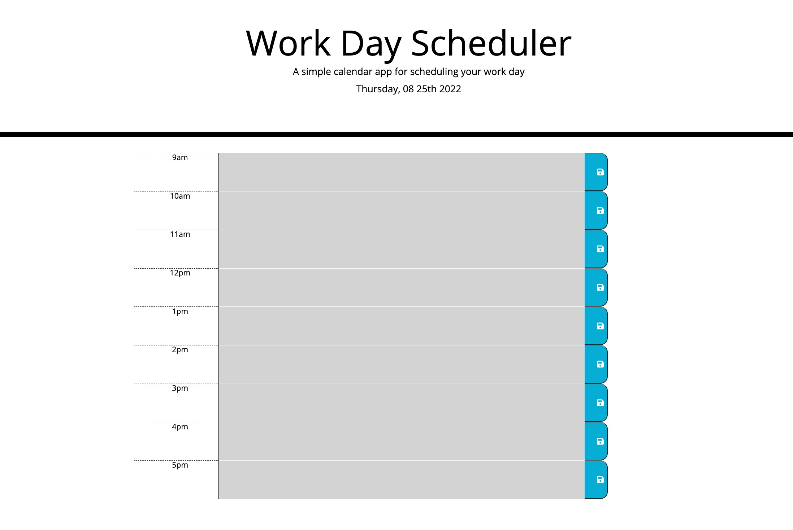

# Work Day Scheduler

## Description
[Deployed Site](https://dstelzl.github.io/work-day-scheduler/)
The Work Day Scheduler is designed to display the current day at the top of the viewport with a calendar by hour feature below that shows different colors for past, present or future times during the business day. The center area of each row recieves text input by the user that is then saved to Local Storage for future use by clicking on the save button.

## Visuals

## Contributors

Designed by Deborah Stelzl
